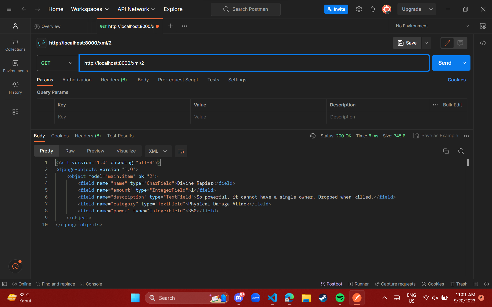

# Assignment 2

> [Click Here](https://raf-inventory.adaptable.app/main/) to access RAF's Inventory App

## Answer Section:

### How do I implement the tasks form the checklist in Assignment 2?

#### 1. Create a new Django project.
- When creating Django project, I started it with cloning the repository, so I don't have to connect local repository to the Github repository. So, I use this command:
    ```
    git clone [URL]
    ```
- Then I started by creating a virtual environment with:
    ```
    python -m venv env
    ```
- Then I need to activate the virtual environment with the following command:
    ```
    env\Scripts\activate.bat
    ```
- After that I have to set up dependencies, which are components required by the software to function, including libraries, frameworks, or packages. So, we create a .txt file named `requirements.txt`, and add some dependencies.
    ```
    django
    gunicorn
    whitenoise
    psycopg2-binary
    requests
    urllib3
    ```
- Install those dependencies with pip install:
    ```
    pip install -r requirements.txt
    ```
- Finally, I created the Django project with name `assignment2`, and note I don't know how to change this name to a new name because, at first I accidentally create the Django project with this name, and I want to change it with rafinventory, *please help*. I use this following command:
    ```
    django-admin startproject assignment2 .
    ```
- Then, I successfully create the Django project.
- In `settings.py`, I add `"*"` to `ALLOWED_HOSTS` for deployment purposes
- Finally, I create a `.gitignore` file.
#### 2. Create an app with the name main on that project:
- First, I did  it with this following command to create a new application `main`:
    ```
    python manage.py startapp main
    ```
- Then, I have to register `main` application to the project by adding `'main'` in the `INSTALLED_APPS` inside the `settings.py`.
- After that, I created new directory `templates` within the `main` application, and inside it we create `main.html`. Then we successfully create app main with HTML templates.

#### 3. Create URL routing configuration to access the `main` app.
- I add URL routing in `urls.py` to connect it to the `main` view. So, in the `urls.py` inside the `assignment2` directory, I import `include` funtion from module `django.urls`

- I add the URL pattern to direct it to the `main` view inside the `urlpatterns` variable.
    ```
    path('main/', include('main.urls'))
    ```
- Finally, I successfully create URL routing configuration to the `main` app.

#### 4. Create a model on the main app with the name Item and some mandatory attributes:
- In the `models.py` I create a class named `Item` with this attributes:
    - `name` as the name of the item, with type `CharField`.
    - `amount` as the amount/count of the item, with type `IntegerField`.
    - `description` as the description of the item, with type `TextField`.
    - `category` as the category of the item, with type `TextField`.
    - `power` as the amount of power of the item, with type `IntegerField`.
- Then, I create model migrations with:
    ```
    python manage.py makemigrations
    ```
- After that, I apply the migrations with the local database:
    ```
    python manage.py migrate
    ```

#### 5. Create a funtion in `views.py` that returns an HTML template containing my application name, my name, and my class.
- First, I open `views.py` in the `main` application. Then on the file I add the following import statements, and add function `show_main`:
    ```
    from django.shortcuts import render

    def show_main(request):
    context = {
        'application_name': 'RAF Inventory',
        'name': 'Rafif Firmansyah Aulia',
        'class': 'PBP KKI'
    }

    return render(request, 'main.html', context)
    ```
- After that, I replace created application name, name, and class in the `main.html` file in `templates`.

#### 6. Create a routing in `urls.py` to map the function `views.py` to an URL.
- I create a file `urls.py` inside `main` application directory, and fill it with this following code:
    ```
    from django.urls import path
    from main.views import show_main
    
    app_name = 'main'

    urlpatterns = [
       path('', show_main, name='show_main'),
    ]
    ```
#### 7. Deploy the app to adaptable.
- First, perform add, commit, push to the github repository.
- Then, create new app in adaptable, and connect the repository to adaptable.
- After that, I use Python App template and PostgreSQL, then I chose python 3.10 as the version and in the start command I use:
    ```
    python manage.py migrate && gunicorn assignment2.wsgi
    ```
- Then enter the domain name, also check the HTTP Listener on PORT.
- Finally, deploy the app to adaptable.


### Diagram explaining the flow of client requests to a Django web app and its response. 


### What is the purpose of a virtual environment? Can we create a Django web app without a virtual environment? 
Virtual environment is a fundamental tool in Python development. It serves as an isolated workspace, ensuring that each project remains independent of others and the global Python environment. This isolation is critical for managing distinct Python and package versions required for different projects. Analogously, it's akin to maintaining an organized workspace. Just as you wouldn't want your tools intermingled in disarray, virtual environments keep project directories neat and tidy. Additionally, they simplify project sharing and enhance portability. In the context of Django web applications, virtual environments are imperative. They help manage dependencies, ensuring a clean and isolated environment conducive to project development. In conclusion, virtual environments are indispensable for maintaining order, preventing conflicts, and facilitating structured Python project development, particularly for Django web applications.

### What is MVC, MVT, and MVVM? Explain the differences between the three.

- MVC, which stands for Model-View-Controller, is a software architecture. In this pattern, the Model takes care of storing data and managing application logic, the View presents data from the Model to users, and the Controller acts as a middleman between the Model and View.

- MVT, or Model-View-Template, is another software design pattern. Similar to MVC, the Model is responsible for data and application logic, the View displays data from the Model, and it connects this data to a Template. The Template defines how the user interface should look.

- MVVM, short for Model-View-ViewModel, is yet another architectural pattern. Here, the Model still stores data and logic, the View shows this data, and the ViewModel transforms data from the Model into a format that's easily presented and interacted with by the View.

MVC and MVT are quite alike, differing mainly in the terminology they use and how they implement their specific frameworks. On the other hand, MVVM emphasizes a clear separation between the View and ViewModel, focusing on data binding and two-way communication between them.

# Assignment 3

## Answer Section:

### What is the difference between POST form and GET form in Django?

#### GET Form:
- Data is appended to the URL as query parameters.
- Data is visible in the URL.
- Used for read-only operations and sharing URLs.
- Limited data size due to URL length restrictions.

#### POST Form:
- Data is sent in the HTTP request body.
- Data is not visible in the URL.
- Used for operations that modify server-side data.
- No inherent data size limitations.

In Django, you can access form data via both POST and GET requests using the request object in your views. The choice depends on data sensitivity, the type of operation, and data size considerations.

### What are the main differences between XML, JSON, and HTML in the context of data delivery?

#### Purpose:
- XML: Primarily for structured data exchange.
- JSON: Lightweight data exchange format.
- HTML: For creating web content.

#### Syntax:
- XML: Verbose with explicit tags.
- JSON: Simple key-value pairs and arrays.
- HTML: Uses specific tags for web content.

#### Data Types:
- XML: No built-in data types.
- JSON: Supports basic data types.
- HTML: Focuses on text, links, and media.

#### Readability:
- XML: Less human-readable.
- JSON: Highly readable.
- HTML: Designed for human consumption.

#### Usage:
- XML: Configuration files, data exchange.
- JSON: Web APIs, data exchange.
- HTML: Web content presentation.

### Why is JSON often used in data exchange between modern web applications?

JSON is popular in web applications because it's lightweight, human-readable, works with any programming language, and is secure. Its efficiency, native JavaScript support, and compatibility with cross-domain requests make it a preferred format for data exchange, especially in web APIs.

### How I implemented the task above step-by-step

 - Before creating form input, I have to implement a skeleton as a  view structure.

 - First I create a folder named `templates` in the root directory. Inside that I create a file named `based.html`. Inside of it I insert:

    ```
    
    <!DOCTYPE html>
    <html lang="en">
        <head>
            <meta charset="UTF-8" />
            <meta
                name="viewport"
                content="width=device-width, initial-scale=1.0"
            />
            
            
        </head>

        <body>
            
            
        </body>
    </html>
    ```
- In the `settings.py` on the `assignment2` folder, I enable the detection of `base.html` as a template file

- In `templates` inside `main` folder, I change `main.html` with:
    ```
    

    
        <h1>RAF Inventory</h1>

        <h5>Application name:</h5>
        <p>{{ application_name }}</p>

        <h5>Name:</h5>
        <p>{{ name }}</p>

        <h5>Class:</h5>
        <p>{{ class }}</p>
    
    ```

- Then, I start to create a Data input Form

- I create a new file inside `main` named `forms.py`, which is used to create a form structure that accepts data. Fill it with:
    ```
    from django.forms import ModelForm
    from main.models import Item

    class ItemForm(ModelForm):
        class Meta:
            model = Item
            fields = ["name", "amount", "description", "category", "power"]
    ```
- In `views.py` in the `main` I add some of the code with import and a new function called `create_item`.
    ```
    from django.http import HttpResponseRedirect
    from django.urls import reverse
    from main.forms import ItemForm
    from main.models import Item

    def create_item(request):
    form = ItemForm(request.POST or None)

    if form.is_valid() and request.method == "POST":
        form.save()
        return HttpResponseRedirect(reverse('main:show_main'))

    context = {'form': form}
    return render(request, "create_item.html", context)
    ```

- Then I change the `show_main` function inside this file with:
    ```
    def show_main(request):
    items = Item.objects.all()

    context = {
        'application_name': 'RAF Inventory',
        'name': 'Rafif Firmansyah Aulia',
        'class': 'PBP KKI',
        'items': items,
    }

    return render(request, 'main.html', context)
    ```

- On `urls.py` inside `main` folder, I import previously created funtion, which is `create_item`.

- And I add new url path inside the `urlpatterns` to access the new importedd function.

- In `templates` directory inside `main`, I created new HTML file `create_item.html`. And fill it with this:
    ```
     

    
    <h1>Add New Item</h1>

    <form method="POST">
        
        <table>
            {{ form.as_table }}
            <tr>
                <td></td>
                <td>
                    <input type="submit" value="Add Item"/>
                </td>
            </tr>
        </table>
    </form>

    
    ```

- In `main.html` I modified new code between `` and ``.
    ```
    <table>
        <tr>
            <th>Name</th>
            <th>Amount</th>
            <th>Description</th>
            <th>Category</th>
            <th>Power</th>
            <th>Date Added</th>
        </tr>

         Below is how to show the item data 

        
            <tr>
                <td>{{item.name}}</td>
                <td>{{item.price}}</td>
                <td>{{item.description}}</td>
                <td>{{item.category}}</td>
                <td>{{item.power}}</td>
                <td>{{item.date_added}}</td>
            </tr>
        
    </table>

    <br />

    <a href="">
        <button>
            Add New Item
        </button>
    </a>

    
    ```

- After that I run migrate because I tried running with `py manage.py runserver` and it didn't work. So i run `py manage.py makemigrations` and after that `py manage.py makemigrations`.

- in `views.py` in the `main` folder I add import `HttpResponse` and `serializers` and add a new function called `show_xml` . This what I add:
    ```
    from django.http import HttpResponse
    from django.core import serializers

    def show_xml(request):
        data = Item.objects.all()
        return HttpResponse(serializers.serialize("xml", data), content_type="application/xml")
    ```
- In `urls.py` inside `main`. I import the created function `show_xml`.
- Then route the urls path in the `urlpatterns`:
    ```
    path('xml/', show_xml, name='show_xml'),
    ```
    add this code.

- Do the same thing with the **JSON**.

- I want to get the xml and json by ID. Firstly, I created new function `show_xml_by_id` with this code:
    ```
    def show_xml_by_id(request, id):
        data = Item.objects.filter(pk=id)
        return HttpResponse(serializers.serialize("xml", data), content_type="application/xml")
    ```
    After that I import the code to `urls.py` and add path to `urlpatterns`.

- To implement the ** JSON by ID** I just do the same thing like the xml.

### Access the five URLs in point 2 using Postman, take screenshots of the results in Postman, and add them to README.md.

- **HTML**


- **XML**


- **JSON**


- **XML by ID**


- **JSON by ID**
